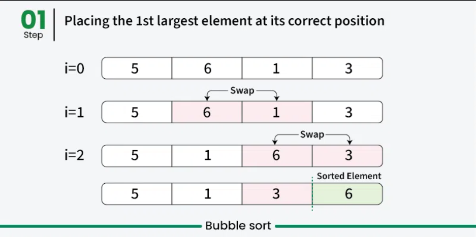
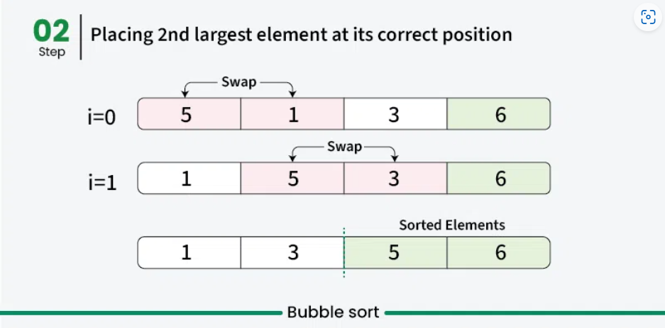
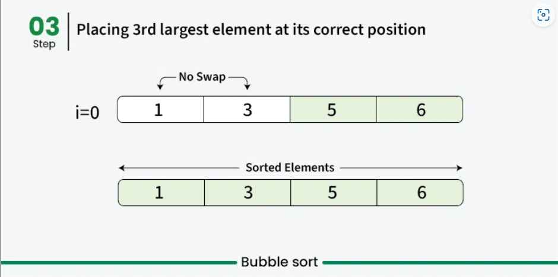

# BUBBLE SORT
- Bubble Sort is the simplest sorting algorithm that works by repeatedly swapping the adjacent elements if they are in the wrong order.
- It is a stable sorting algorithm, meaning that elements with the same key value maintain their relative order in the sorted output.
- Bubble sort performs the swapping of adjacent pairs without the use of any major data structure. Hence Bubble sort algorithm is an in-place algorithm.

## How it works
- In every pass, compare two adjacent elements and swap if larger element is before a smaller element.
- After the first pass, the maximum element goes to end (its correct position). Same way, after second pass, the second largest element goes to second last position and so on.
<p align="center"></p>
<p align="center"></p>
<p align="center"></p>

## Code
```cpp
#include <bits/stdc++.h>
using namespace std;
void bubbleSort(vector<int> &v){
	int n = v.size();
	bool isSwapped;
	for(int i=0;i<n-1;i++){
		isSwapped = false;
		for(int j=0;j<n-1-i;j++){
			if(v[j]>v[j+1]){
				swap(v[j], v[j+1]);
				isSwapped = true;
			}
		}
		if(!isSwapped) break;	//array already has been sorted
	}
}
int main(){
	vector<int> v = {12, 11, 13, 5, 6, 7};
	bubbleSort(v);
	cout<<"Sorted elements: ";
	for(int i=0;i<v.size();i++){
		cout<<v[i]<<" ";
	}
	cout<<endl;
}
```
## Complexity Analysis
### Time Complexity
- **Best Case:** `O(n)`. When the array is aleady sorted.
- **Worst Case:** `O(n^2)`. When the array is sorted in reverse order.
- **Average Case:** `O(n^2)`. 
### Space Complexity
- **Auxiliary Space:** `O(1)`. Doesn't require any additional memory space.
## Q&A
Q1. Why is Bubble Sort called "Bubble Sort"?<br>
a. Because elements are sorted using a pivot.<br>
b. Because larger elements bubble to the top during each pass.<br>
c. Because it uses recursion for sorting.<br>
d. Because it sorts in-place.<br>
Answer: b. **Because larger elements bubble to the top during each pass.**

Q2. How many passes does Bubble Sort perform to completely sort an array of size n in the worst case?<br>
a. n<br>
b. n−1<br>
c. n^2<br>
d. logn<br>
Answer: b. **n−1**

Q3. What optimization can be applied to Bubble Sort to improve its efficiency?<br>
a. Use a different pivot element.<br>
b. Stop the algorithm if no swaps are made in a pass.<br>
c. Divide the array into smaller parts.<br>
d. Use an auxiliary array to store intermediate results.<br>
Answer: **b. Stop the algorithm if no swaps are made in a pass.**

Q4. Bubble Sort is best suited for:<br>
a. Large datasets.<br>
b. Small datasets that are mostly sorted.<br>
c. Randomly ordered datasets.<br>
d. Datasets with duplicate values.<br>
Answer: b. **Small datasets that are mostly sorted.**

Q5. Bubble Sort is an example of which algorithmic paradigm?<br>
a. Divide and conquer<br>
b. Greedy<br>
c. Brute force<br>
d. Dynamic programming<br>
Answer: c. **Brute force**


