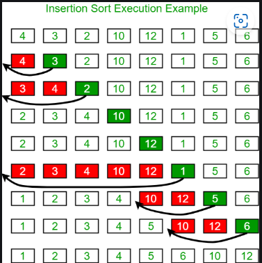

# INSERTION SORT
- Insertion sort is a simple sorting algorithm that works by iteratively inserting each element of an unsorted list into its correct position in a sorted portion of the list.
- It is a `stable` sorting algorithm, meaning that elements with the same key value maintain their relative order in the sorted output.
- Efficient for small lists and nearly sorted lists.
- Space-efficient as it is an `in-place` algorithm.
- Used as a subroutine in Bucket Sort.
- The Insertion Sort algorithm follows an `incremental` approach. 

## How it works
- We start with second element of the array as first element in the array is assumed to be sorted.
- Compare second element with the first element and check if the second element is smaller then swap them.
- Move to the third element and compare it with the first two elements and put at its correct position
- Repeat until the entire array is sorted.

<p align="center"></p>


## Code
```cpp
#include <bits/stdc++.h>
using namespace std;
void insertionSort(vector<int> &v, int n){
	for(int i=1;i<n;i++){
		int key = v[i];
		int j = i-1;
		while(j>=0 and v[j]>key){
			v[j+1] = v[j];
			j--;
		}
		v[j+1] = key;
	}
}
int main(){
	int n;
	cin>>n;
	vector<int>v(n);
	for(int i=0;i<n;i++){
		cin>>v[i];
	}
	insertionSort(v, n);
	for(int i=0;i<n;i++){
		cout<<v[i]<<" ";
	}
	cout<<endl;
}
```
## Complexity Analysis
### Time Complexity
- **Best Case:** `O(n)`. When the array is aleady sorted.
- **Worst Case:** `O(n^2)`. When the array is sorted in reverse order.
- **Average Case:** `O(n^2)`. When the array is in random order. 
### Space Complexity
- **Auxiliary Space:** `O(1)`. Doesn't require any additional memory space.
## Q&A
Q1. Which of the following data structures is NOT used in insertion sort?<br>
a. Array<br>
b. Heap<br>
c. Linked List<br>
d. None of the above<br>
Answer: **b. Heap.**

Q2. How does Insertion Sort work?<br>
a. It divides the array into two halves and merges them after sorting.<br>
b. It selects the smallest element and swaps it with the first unsorted element.<br>
c. It builds a sorted list by inserting one element at a time in the correct position.<br>
d. It repeatedly partitions the array and sorts each partition separately.<br>
Answer: **c. It builds a sorted list by inserting one element at a time in the correct position.**

Q3. Insertion sort is an example of which type of algorithm?<br>
a. Divide and Conquer<br>
b. Incremental Approach<br>
c. Dynamic Programming<br>
d. Backtracking<br>
Answer: **b. Incremental Approach.**

Q4. Which of the following statements about Insertion Sort is true?<br>
a. It always requires O(n²) comparisons and swaps.<br>
b. It is better than Quick Sort for large datasets.<br>
c. It is an online sorting algorithm.<br>
d. It cannot be implemented iteratively.<br>
Answer: **c. It is an online sorting algorithm.**
`N.B: An online sorting algorithm is an algorithm that can process input data as it arrives, meaning it can sort a sequence of elements without needing to have all elements available from the beginning. In other words, it can handle dynamic input and update the sorted order as new elements arrive. 
Online: Insertion, Bubble, Merge sort(adaptive version).
Non-Online: Quick, Merge, Heap sort.`

Q5. If an array of size 5 is sorted using Insertion Sort, what is the maximum number of shifts needed in the worst case?<br>
a. 5<br>
b. 7<br>
c. 10<br>
d. 15<br>
Answer: **c. 10**


