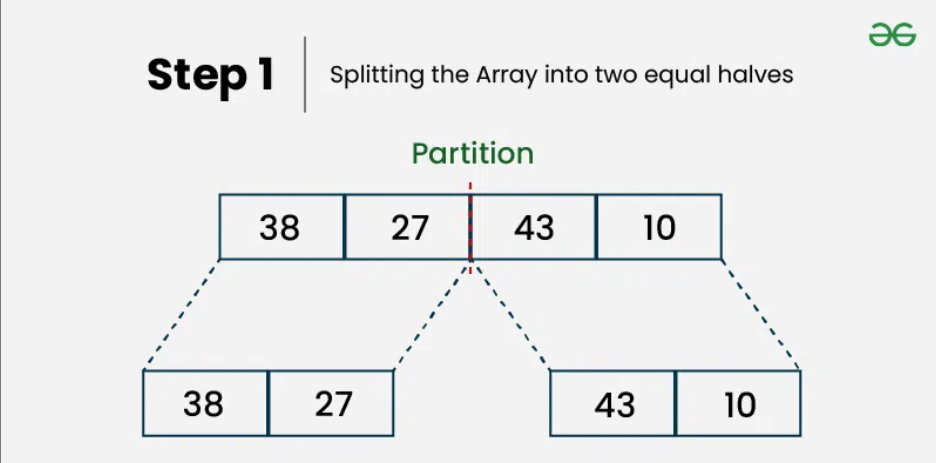
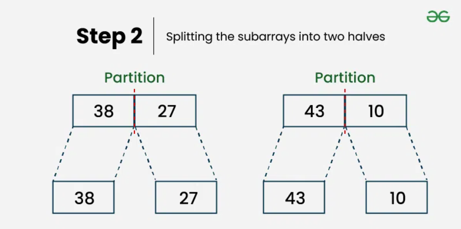
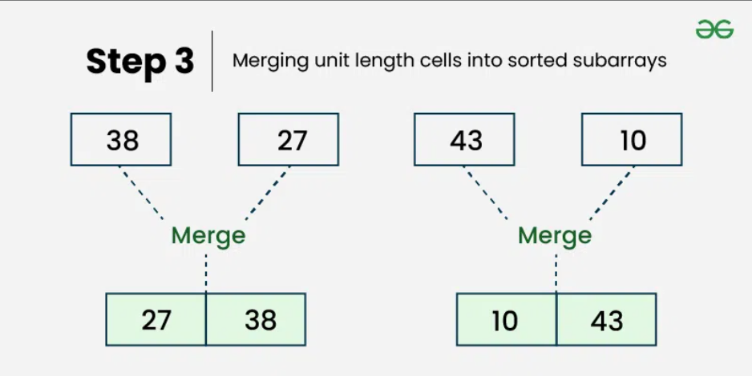
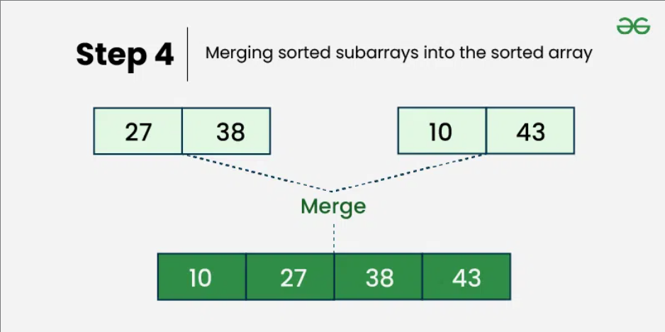

# MERGE SORT
- It follows divide and conquer approach.
- It is known for its efficiency and stability.
- Used in sorting large datasets.
- It is a preferred algorithm for sorting Linked lists.
- Merge sort is a stable sorting algorithm, which means it maintains the relative order of equal elements in the input array.
- Merge sort is not an in-place sorting algorithm, which means it requires additional memory to store the sorted data.
- Slower than QuickSort in general.
## How it works
- **Divide:** Divide the list or array recursively into two halves until it can no more be divided.
- **Conquer:** Each subarray is sorted individually using the merge sort algorithm.
- **Merge:** The sorted subarrays are merged back together in sorted order. The process continues until all elements from both subarrays have been merged.
<p align="center"></p>
<p align="center"></p>
<p align="center"></p>
<p align="center"></p>

## Code
```cpp
#include <bits/stdc++.h>
using namespace std;
void merge(vector<int> &v, int low, int mid, int high){
	int n1 = mid-low+1;
	int n2 = high-mid;
	vector<int>left_subarray(n1), right_subarray(n2);
	for(int i=0;i<n1;i++){
		left_subarray[i] = v[low+i];
	}
	for(int j=0;j<n2;j++){
		right_subarray[j] = v[mid+1+j];
	}
	int i = 0, j = 0, k = low;
	//merge the vectors
	while(i<n1 and j<n2){
		if(left_subarray[i]<=right_subarray[j]){
			v[k] = left_subarray[i];
			i++;
		}
		else{
			v[k] = right_subarray[j];
			j++;
		}
		k++;
	}
	//copy remaining elements of left subarray if have any
	while(i<n1){
		v[k] = left_subarray[i];
		i++;
		k++;
	}
	//copy remaining elements of right subarray if have any
	while(j<n2){
		v[k] = right_subarray[j];
		j++;
		k++;
	}
}
void mergeSort(vector<int> &v, int low, int high){
	if(low >= high){
		return;
	}
	int mid = (low + high) / 2;
	mergeSort(v, low, mid);
	mergeSort(v, mid+1, high);
	merge(v, low, mid, high);
}
int main(){
	vector<int> v = {12, 11, 13, 5, 6, 7};
	mergeSort(v, 0, v.size()-1);
	cout<<"Sorted elements: ";
	for(int i=0;i<v.size();i++){
		cout<<v[i]<<" ";
	}
	cout<<endl;
}
```
## Complexity Analysis
### Time Complexity
- **Best Case:** `O(nlogn)`, When the array is already sorted or nearly sorted.
- **Average Case:** `O(nlogn)`, When the array is randomly ordered.
- **Worst Case:** `O(nlogn)`, When the array is sorted in reverse order.
### Space Complexity
- **Auxiliary Space:** `O(n)`, Additional space is required for the temporary array used during merging.
### Q&A
Q1. In Merge Sort, the merging of two sorted subarrays takes:<br>
a. O(n)<br>
b. O(logn)<br>
c. O(n^2)<br>
d. O(1)<br>
Answer: a. **O(n)**

Q2. Merge Sort is better suited for:<br>
a. Small datasets<br>
b. Sorting linked lists<br>
c. Sorting data with a lot of duplicate values<br>
d. Both b and c<br>
Answer: d. **Both b and c**

Q3. What is the base case for Merge Sort?<br>
a. When the array has a single element or is empty.<br>
b. When the pivot is found.<br>
c. When the array is already sorted.<br>
d. None of the above.<br>
Answer: a. **When the array has a single element or is empty.**

Q4. Merge Sort performs better than Quick Sort when:<br>
a. The dataset is very large and fits in memory.<br>
b. The dataset is very small.<br>
c. The dataset is stored as a linked list.<br>
d. The dataset contains unique elements.<br>
Answer: c. **The dataset is stored as a linked list.**

Q5. What is the key operation performed in the merge step of Merge Sort?<br>
a. Splitting the array into halves.<br>
b. Combining two sorted subarrays into one.<br>
c. Finding the pivot.<br>
d. Rearranging the elements in place.<br>
Answer: b. **Combining two sorted subarrays into one.**