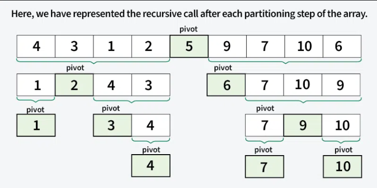
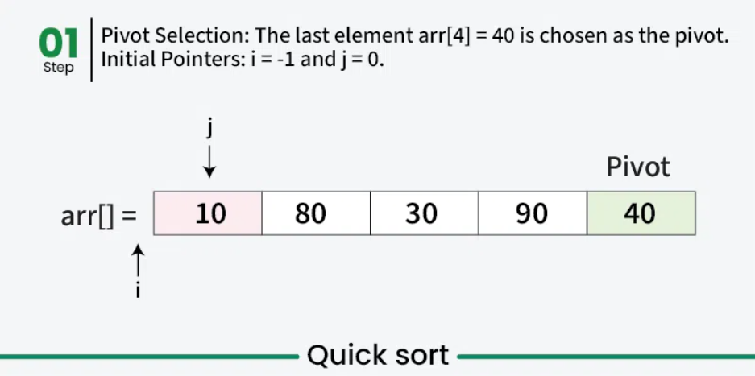
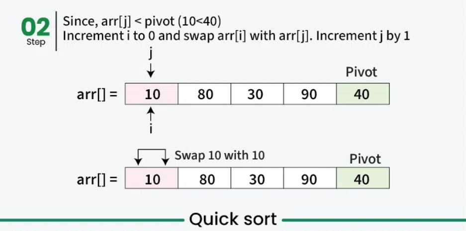
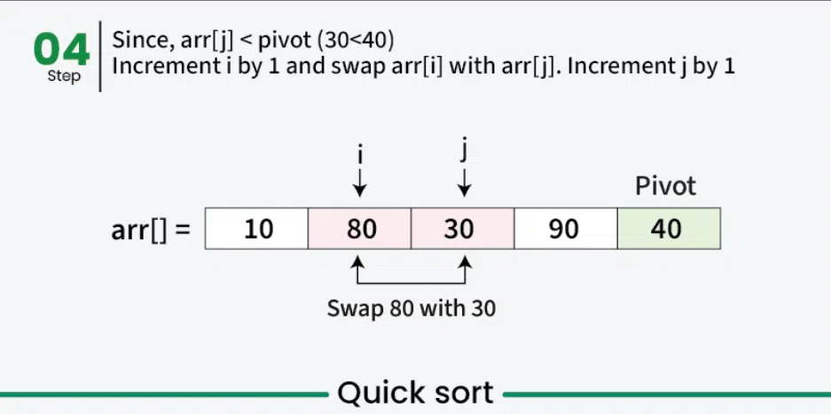
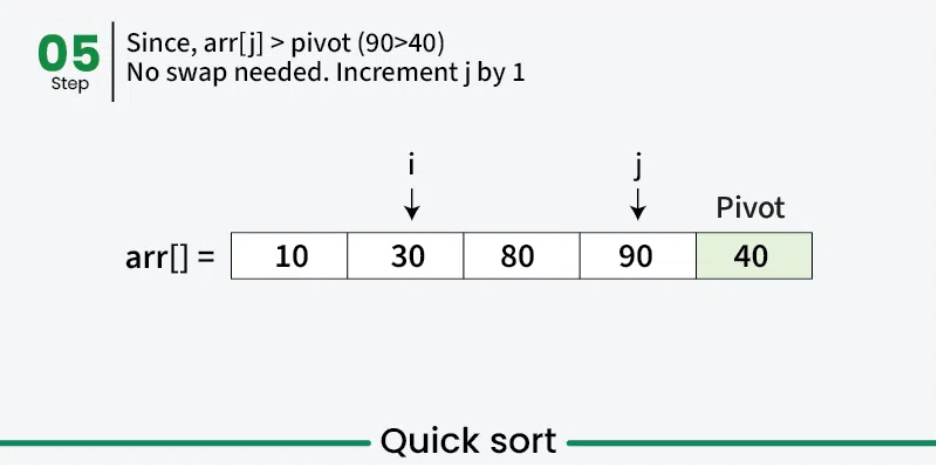
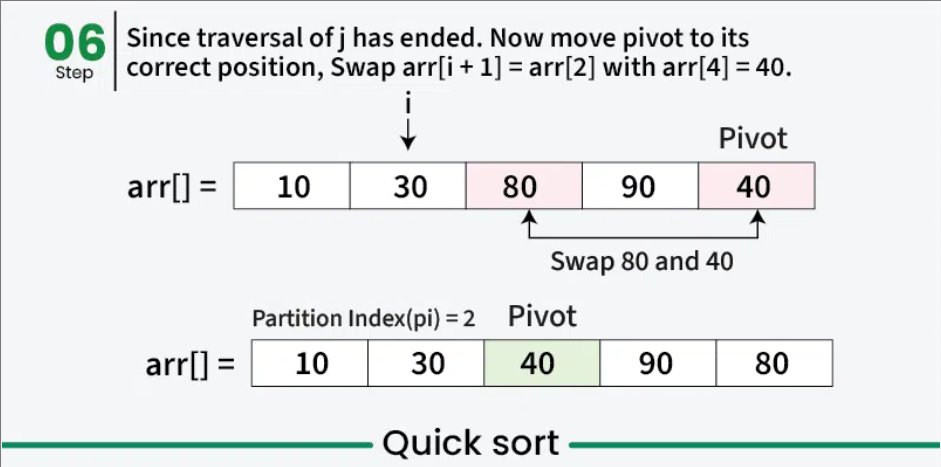
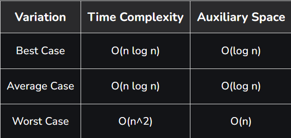

## QUICK SORT
- It's a **divide and conquer** algorithm that picks an element as a pivot and partitions the given array around the picked pivot by placing the pivot in its correct position in the sorted array.
- It is efficient on **large data sets**.
- Fastest general purpose algorithm for large data when **stability** is not required.
- It is **not a stable** sort, meaning that if two elements have the same key, their relative order will not be preserved in the sorted output in case of quick sort, because here we are swapping elements according to the pivot’s position (without considering their original positions).
### How it works
- Choose a pivot(first, last, mid or any elements).
- Rearrange the array so that all elements smaller than the pivot will be on the left and all elements greater than the pivot will be on the right.
- Recursively apply the same process for the partitioned subarrays.
<p align="center"></p>

### Algorithm
- Choose the last element as pivot. Initialize `i=-1` and `j=0`.
- If `arr[j]<pivot`, increment `i` and swap `arr[i]` and `arr[j]`. Increment `j`.
- Else if `arr[j]>=pivot`, no swap needed, increment `j`.
<p align="center"></p>
<p align="center"></p>
<p align="center"></p>
<p align="center"></p>
<p align="center"></p>
<p align="center"></p>

### Code
```cpp
#include <bits/stdc++.h>
using namespace std;
int getPivotIndex(vector<int> &v, int low, int high){
	int pivot = v[high];    //choose the last element as pivot
	int i = low-1;
	for(int j=low;j<high;j++){
		if(v[j] < pivot){
			i++;
			swap(v[i], v[j]);
		}
	}
	swap(v[i+1], v[high]);
	return i+1;
}
void quickSort(vector<int> &v, int low, int high){
	if(low < high){
		int pivot_Index = getPivotIndex(v, low, high);  //get the pivot index
		quickSort(v, low, pivot_Index-1);   //recursive call for left subarray
		quickSort(v, pivot_Index+1, high);  //recursive call for right subarray
	}
}
int main(){
	vector<int> v = {10, 7, 8, 9, 1, 5};
	quickSort(v, 0, v.size()-1);
	cout<<"Sorted elements: ";
	for(int i=0;i<v.size();i++){
		cout<<v[i]<<" ";
	}
	cout<<endl;
}
```
### Complexity Analysis
#### Time Complexity
- **Best case:** `O(nlogn)`, when the pivot element divides the array into two equal halves.
- **Average case:** `O(nlogn)`, when the pivot element divides the array into two halves, not necessarily equal.
- **Worst case:** `O(n^2)`, when the array is sorted(when the smallest or the largest element is choosen).
#### Space Complexity
- No space needed for input array, space complexity arises due to the recursion stack.
- **Best case:** `O(logn)`, when the pivot element divides the array into two equal halves.
- **Average case:** `O(logn)`, when the pivot element divides the array into two halves, not necessarily equal.
- **Worst case:** `O(n)`, due to unbalanced partitioning causing a skewed recursion tree that requires a call stack of size `O(n)`.
<p align="center"></p>

### Q&A
Q1. Which of the following can improve Quick Sort’s performance in the worst case?<br>
a. Randomized pivot selection<br>
b. Always choosing the first element as the pivot<br>
c. Sorting a sorted array<br>
d. Using a stack-based approach<br>
Answer: a. **Randomized pivot selection**

Q2. What is the primary advantage of Quick Sort over Merge Sort?<br>
a. Stability<br>
b. Worst-case performance<br>
c. Space efficiency<br>
d. Simplicity of implementation<br>
Answer: c. **Space efficiency**

Q3. In Quick Sort, if the pivot divides the array into two equal halves at every step, the depth of recursion will be:<br>
a. O(n)<br>
b. O(log n)<br>
c. O(n²)<br>
d. O(1)<br>
Answer: b. **O(log n)**

Q4. Which of the following modifications is NOT used to optimize Quick Sort?<br>
a. Median-of-three pivot selection<br>
b. Switching to Insertion Sort for small subarrays<br>
c. Randomized pivot selection<br>
d. Using an auxiliary array for partitioning<br>
Answer: d. **Using an auxiliary array for partitioning**

Q5. Quick Sort is typically implemented:<br>
a. Iteratively using a stack<br>
b. Recursively<br>
c. Both iteratively and recursively<br>
d. Using only a loop<br>
Answer: c. **Both iteratively and recursively**

Q6. If Quick Sort is implemented using a loop instead of recursion, what is used to simulate the recursive calls?<br>
a. Queue<br>
b. Array<br>
c. Stack<br>
d. Linked List<br>
Answer: c. **Stack**

Q7. Why is Quick Sort generally faster than other sorting algorithms in practical scenarios?
a. It always uses O(1) space<br>
b. It avoids recursion<br>
c. It has better cache performance due to in-place sorting<br>
d. It does not use pivot selection<br>
Answer: c. **It has better cache performance due to in-place sorting**

Q8. What happens in Quick Sort when all elements in the array are identical?<br>
a. Best-case time complexity is achieved<br>
b. Average-case time complexity is achieved<br>
c. Worst-case time complexity is achieved<br>
d. Time complexity is O(1)<br>
Answer: c. **Worst-case time complexity is achieved**

Q9. Quick Sort’s performance can be improved by:<br>
a. Choosing the largest element as the pivot<br>
b. Sorting an already sorted array<br>
c. Choosing the median-of-three as the pivot<br>
d. Reducing the number of comparisons<br>
Answer: c. **Choosing the median-of-three as the pivot**

Q10. Which of the following is true about the partitioning step in Quick Sort?<br>
a. The pivot is always placed at the first position of the array.<br>
b. The pivot element is placed in its final sorted position.<br>
c. The pivot is not included in the partitioned subarrays.<br>
d. The partitioning step merges two sorted arrays.<br>
Answer: b. **The pivot element is placed in its final sorted position.**