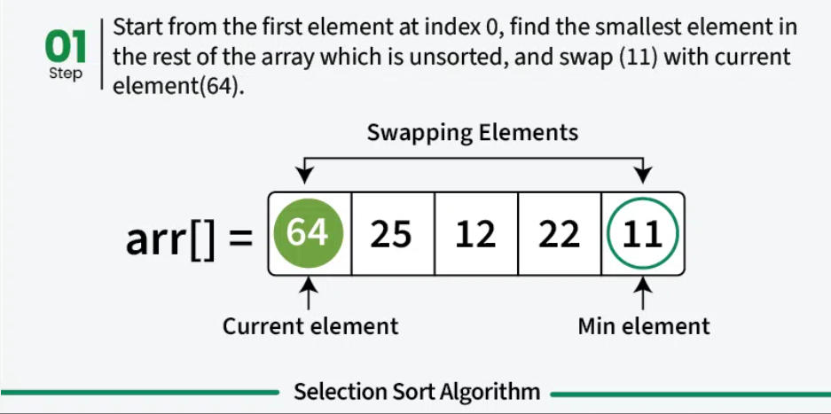
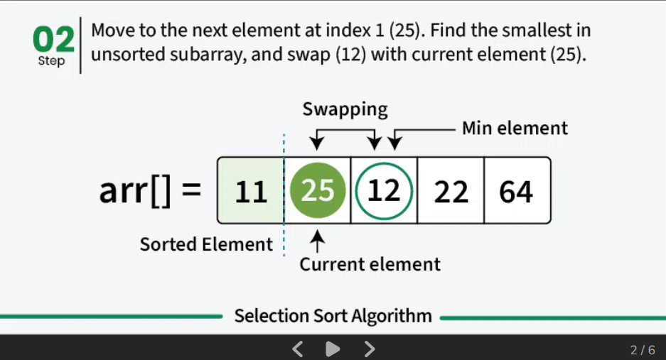
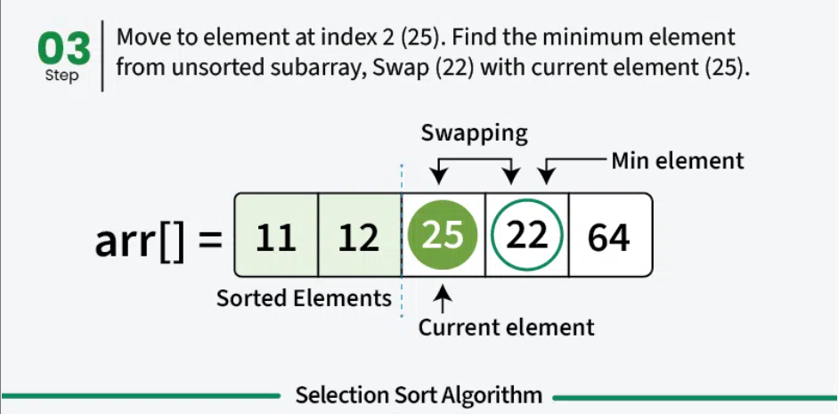
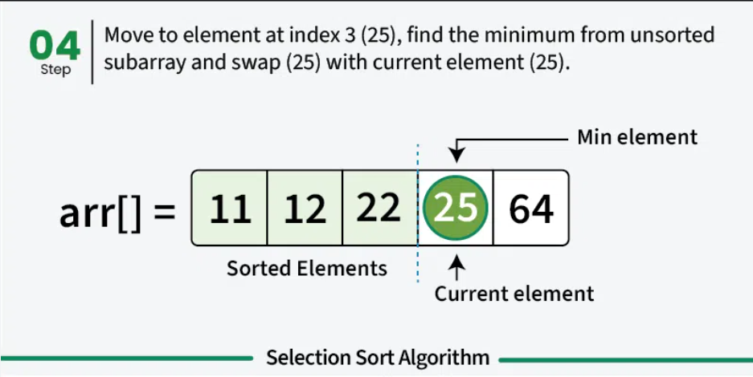
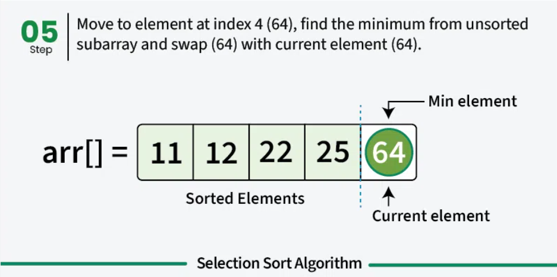
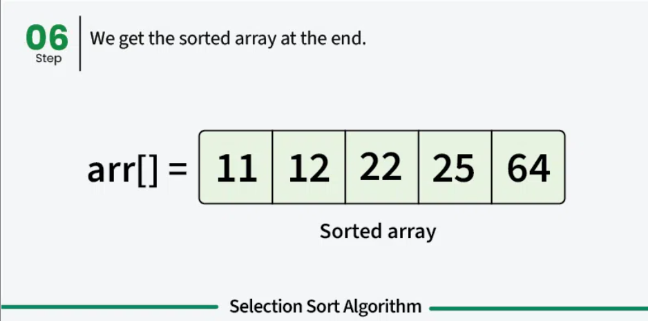

# SELECTION SORT
- It sorts an array by repeatedly selecting the smallest (or largest) element from the unsorted portion and swapping it with the first unsorted element.
- Does not maintain the relative order of equal elements which means it is not stable.
- uitable for small lists where the overhead of more complex algorithms isn’t justified and memory writing is costly as it requires less memory writes compared to other standard sorting algorithms.
- Heap Sort algorithm is based on Selection Sort.
- Selection Sort is an in-place sorting algorithm and requires only O(1) additional space.

## How it works
- First we find the smallest element and swap it with the first element. This way we get the smallest element at its correct position.
- Then we find the smallest among remaining elements (or second smallest) and swap it with the second element.
- We keep doing this until we get all elements moved to correct position.
<p align="center"></p>
<p align="center"></p>
<p align="center"></p>
<p align="center"></p>
<p align="center"></p>
<p align="center"></p>


## Code
```cpp
#include <bits/stdc++.h>
using namespace std;
void selectionSort(vector<int> &arr){
	for(int i=0;i<arr.size();i++){
		int min_index = i;					//select an element
		for(int j=i+1;j<arr.size();j++){
			if(arr[j]<arr[min_index]){		//check unsorted part for min
				min_index = j;
			}
		}
		swap(arr[i], arr[min_index]);		//swap 
	}
}
int main() {
   vector<int> arr = {64, 25, 12, 22, 11};
   selectionSort(arr);
   for(int i=0;i<arr.size();i++){
       cout<<arr[i]<<" ";
   }
   cout<<endl;
}

```
## Complexity Analysis
### Time Complexity
- **Best Case:** `O(n^2)`.
- **Worst Case:** `O(n^2)`.
- **Average Case:** `O(n^2)`. 
### Space Complexity
- **Auxiliary Space:** `O(1)`. Doesn't require any additional memory space. In-place sorting, no extra memory used.
## Q&A
Q1.  Which of the following sorting algorithms performs the least number of swaps?<br>
a. Bubble sort<br>
b. Insertion sort<br>
c. Selection sort<br>
d. Quick sort<br>
Answer: **c. Selection sort.**

Q2. Selection Sort is classified as which type of sorting algorithm?<br>
a. Divide and conquer.<br>
b. Dynamic programming.<br>
c. Comparison-based sorting.<br>
d. Non-comparison-based sorting.<br>
Answer: **c. Comparison-based sorting.**

Q3. Which statement is true about Selection Sort?<br>
a. It is stable by default.<br>
b. It is faster than Merge Sort for large inputs.<br>
c. It always scans the full unsorted part to find the minimum.<br>
d. It works better for linked lists.<br>
Answer: **c. It always scans the full unsorted part to find the minimum.**
